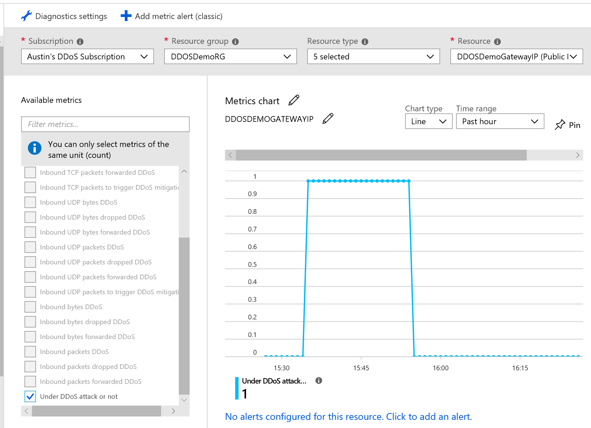

# Azure Security Workshop - Labs

These series of labs are based on the **[Azure Reference Architecture](https://docs.microsoft.com/en-us/azure/architecture/reference-architectures/n-tier/n-tier-sql-server)** to deploy an **N-Tier application**

To simplify and speed up the process of creating this architecture we will only deploy one VM per Tier. Also, the Domain Controller VM 
and AD Domain Services are removed from the lab template, as this could be run on a separate workshop


## Lab Series

1.	Redeem your Azure Passes and activate your credit
2.	Configuration needed before starting the labs
3.	Deploy the solution
4.	Lab 1 - Protecting the Network Perimeter – NSG (Network Security Groups)
5.	Lab 2 - Azure Networking logs
6.	Lab 3 - Control outbound security traffic with Azure Firewall
7.	Lab 4 - Protecting the Web Application - Application Gateway and WAF (Web Application Firewall)
8.	Lab 5 - Understand your application security posture in Azure - Azure Security Center for security recommendations
9.	Lab 6 - Storage Security – Encryption at Rest - Apply disk encryption to a running VM
10.	Lab 7 - Extending your Data Centre to Azure in a secure way – Site to Site VPN Access
11.	Lab 8 - Azure Active Directory Role-Based Access Control
12.	Lab 9 - Enable DDoS protection for your resources

## 1.	Redeem your Azure Passes if you will use your Personal Microsoft Account

*Note: We recommend using an Enterprise Subscription with a working account that has privileges to create resources. There are some labs on this guide that require the use of 3rd party Virtual Machines that do not allow the use of Azure Pass credits. In order to minimise costs we will enable ‘auto’shutdown’ of Virtual Machines.* 

Make sure you have a working Microsoft account that you can use to redeem the Azure pass

Open a browser in Private/Incognito mode and go to https://microsoftazurepass.com


Login with your personal account, confirm your details and click **Next**

Enter the promo code of your Azure Pass

Activate your pass


It will take a few minutes until Azure sets up your new subscription


Next, when you log into https://portal.azure.com, go to **Cost Management + Billing** and you will be able to see your Azure Pass credit.

## 2.  Configuration needed before starting the labs (Time to complete: 15 min)

**1.	Install [Visual Studio Code](https://code.visualstudio.com)** 

**2.	[PowerShell](https://azurecitadel.github.io/guides/powershell) (we need PowerShell version 6)**
- Install the Azure PowerShell module. On your Powershell console:
```
Install-Module AzureRM
```
- Make sure you have installed PowerShell version 6 (or higher).

```
Get-Module AzureRM -ListAvailable | Select-Object -Property Name,Version,Path
```

**3. Install [Azure CLI 2.0](https://docs.microsoft.com/en-us/cli/azure/install-azure-cli?view=azure-cli-latest)**

- Open a Command Prompt (or the Terminal Window in VS Code) and check that running the 'az' command produces command help output (you may need to restart Windows Powershell/Visual Studio Code and re-open again for the installation to register).

- *Note: you might face an issue when you try to run an az command that says*
```
az : The term 'az' is not recognized as the name of a cmdlet, function, script file, or operable program.
```
    The issue is because the Azure CLI 2.0 is installed in location - C:\Users\<username>\AppData\Local\Programs\Python\Python37-32\Scripts\ which is not added to the PATH variable.* 
    1. *First make sure you have python installed in your machine. If you don’t have the original CLI (or python) at all, you need that  first. Download and install it from here: https://www.python.org/downloads/release/python-352/*
      
    1.	Uninstall Azure CLI earlier versions with command - pip uninstall azure-cli
    2.	Re-install Azure CLI 2.0 - pip install --user azure-cli
    3.	Add the path C:\Users\<username>\AppData\Local\Programs\Python\Python37-32\Scripts\ to PATH 
 
- Check if the az command is working:    
 ```
 az --help
 ```
          
**4.	(Optional) Install Visual Studio Code Extensions**
In Visual Studio Code, go to Extensions, search for **Azure CLI Tools** and install the package.

**5.	Install the [Azure building blocks npm package](https://github.com/mspnp/template-building-blocks/wiki/Install-Azure-Building-Blocks)**

- Install **node.js** from the link above (you may need to close and re-open again PowerShell/Visual Studio Code).
- Install the Azure Building Blocks package:
   ```
   npm install -g @mspnp/azure-building-blocks
   ```
- Test Azure Building Blocks with the following command on PowerShell or VS Code:
   ```
   azbb
   ```
        
**6.	From a command prompt, bash prompt, or PowerShell prompt, sign into your Azure account as follows:**
  ```
  az login
  ```
**7.	Make sure you use the right subscription (Enterprise or Azure Pass)**
  To get your Subscription ID, run the following command to list Subscriptions within your account:
  ```
  az account list --query "[].{id:id,name:name}"
  ```
  Note the ID relevant to your Subscription, and set the CLI to use this as the active subscription:
  ```
  az account set --subscription  "<subscription-ID>"
  ```

## 3.  Deploy the Solution (Time to complete: 35 to 40 min)

1.	Run the following command to create a Resource Group (use ‘uksouth’ for location)
  ```
  az group create --location <location> --name <resource-group-name>
  ```
2.	Run the following command to create a Storage Account for your Cloud resources.
  ```
  az storage account create --location <location> --name <storage-account-name> --resource-group <resource-group-name>  --sku Standard_LRS
  ```
3.	In your browser, navigate to https://github.com/davisanc/AzureSecurityLabs 

4.	Open the **n-tier-windows-security-labs.json** file. This file is an Azure Resource Manager (ARM) Template which describes the infrastructure resources we need to use for this lab as code. When deployed, the template will instruct Resource Manager to create the resources as described in the text.

    For more on ARM Templates, please visit: 
    
    [https://docs.microsoft.com/en-us/azure/azure-resource-manager/resource-group-overview#template-deployment](https://docs.microsoft.com/en-us/azure/azure-resource-manager/resource-group-overview#template-deployment)

6.  Just above the main text pane on the Github page, click the **Raw** button to see the unformatted JSON.

7.	Copy and paste the text into a new file in Visual Studio Code. In the JSON text, search for all instances of **adminUsername** and **adminPassword** and replace both the property values with your own admin username and passwords, and save the file locally as **n-tier-windows-security-labs.json**.
Example:

    Before...
    ```
    "adminUsername": "admin",
    "adminPassword": "P4ssw0rd123$%",
    ```
    After...
    ```
    "adminUsername": "adminUserName",
    "adminPassword": "C4ndY*Fl0$S18",
    ```

6.	Run the following `azbb` command to deploy the base resources required for the lab using the ARM template modified above. This will include a Jumpbox, Web VM, Application VM and a SQL Server VM:
    ```
    azbb -s <Subscription-ID> -g <Resource-Group-Name> -l <Location> -p .\<name-of-your-tempalte.json> --deploy
    ```
    *Note: this environment will need about 50 minutes to deploy. Once the last command completes, report to your proctors that you have reached this point*

    The Application and Database tier should have an internal Load Balancer in front of them as per the Azure Reference Architecture, so you can scale up the tier with more VMs if needed and the Load Balancer will distribute the traffic accordingly. However, to speed up the process of creating this architecture, there will be no Load Balancers at the Application and Database Tiers

    The Web Tier is not currently load balanced, as we will create an external Application Gateway in front of the web tier later in the labs.

    For now, the only Internet access to the environment is through the Jump Box as it is the only VM with a Public IP address.

**Test: make sure you can ping from the JB to the Web, Biz and DB virtual machines (enable PING on the firewall settings)**

## 4.  Lab 1 - Protecting the Network Perimeter with Network Security Groups

Create an NSG rule to restrict traffic between tiers. For example, in the 3-tier architecture shown, the web tier does not communicate directly with the database tier. To enforce this, the database tier should block incoming traffic from the web tier subnet

1.	Deny all inbound traffic from the VNet. (Use the VIRTUAL_NETWORK tag in the rule.)
    
    *Note: by default an NSG will have 3 rules pre populated. One to allow traffic from the VNET to VNET, one to allow traffic from the Azure load balancer to VNET, and one default deny. These rules can't be deleted. The idea here is to create a new rule in the NSG with higher priority of the VNET to VNET that blocks this type of traffic*
2.	Allow inbound traffic from the business tier subnet (Use the business subnet range 10.0.2.0/24)
3.	Allow inbound traffic from the database tier subnet itself. This rule allows communication between the database VMs, which is needed for database replication and failover.(Use the business subnet range 10.0.3.0/24)
4.	Allow RDP traffic (port 3389) from the jumpbox subnet. This rule lets administrators connect to the database tier from the jumpbox. (Use the management subnet range 10.0.0.128/25)
5.	Deny all inbound traffic from Internet. Use the “Internet” tag in the rule

Create rules 2 – 4 with higher priority (lower number on the Priority field of the NSG rule) than the first rule, so they are evaluated first

**Apply your NSG to the SQL VM NIC**


Your NSG will look similar to this 


Confirm that you can RDP from the Jumpbox to the SQL server and also from the Business VM but not from the Web VM (you will need to RDP to the JumpBox first, then RDP to the Business and Web VMs to finally RDP to the SQL VM)


## 5. Lab 2 - Azure Networking logs

Network logging and monitoring in Azure is comprehensive and covers two broad categories:
- **Network Watcher**: Scenario-based network monitoring is provided with the features in Network Watcher. This service includes packet capture, next hop, IP flow verify, security group view, NSG flow logs. Scenario level monitoring provides an end to end view of network resources in contrast to individual network resource monitoring.
- **Resource monitoring**: Resource level monitoring comprises four features, diagnostics logs, metrics, troubleshooting, and resource health. All these features are built at the network resource level.

To troubleshoot your NSG rules, enable NSG flow logs. This will enable Network watcher. 
Go to the search bar on the Portal, look for Network Watcher. Filter by your subscription ID and Resource Group


Click on the NSG you worked on the previous lab, enable **Flow Logs**

You will need to select an storage account within your Resource Group. The NSG flow logs will be stored within a blob container of the selected storage account. More details https://docs.microsoft.com/en-us/azure/network-watcher/network-watcher-nsg-flow-logging-portal


Also, you may want to enable **Traffic Analytics for rich analytics and visualization**. You will need to create an **OMS workspace** (select the Free Tier and put it on the same RG and location) and link it to Traffic Analytics
Traffic Analytics provides rich analytics and visualization derived from NSG flow logs and other Azure resources' data. Drill through geo-map, easily figure out traffic hotspots and get insights into optimization possibilities. Learn about all features To use this feature, choose an OMS workspace. To minimize data egress costs, we recommend that you choose a workspace in the same region your flow logs storage account is located. Network Performance Monitor solution will be installed on the workspace. We also advise that you use the same workspace for all NSGs as much as possible. Additional meta-data is added to your flow logs data, to provide enhanced analytics.


Click Save


Finally, to go to Network Watcher, on the left-side of the portal select All services, then enter Monitor in the Filter box. When Monitor appears in the search results, select it. To start exploring traffic analytics and its capabilities, select Network watcher, then Traffic Analytics
The dashboard may take up to 30 minutes to appear the first time because Traffic Analytics must first aggregate enough data for it to derive meaningful insights, before it can generate any reports.

## 6.  Lab 3 – Control outbound security traffic with Azure Firewall

Azure Firewall is a stateful firewall as a service, built in with high availability and cloud scalability. The primary use case for the Azure Firewall is to centrally create, enforce and log application and network policies. As the first version of the product, the firewall is focused on securing outbound flows by FQDN whitelisting/blacklisting. It provides source network address translation and it’s integrated with Azure Monitor for logging and analytics

At this time the Azure Firewall is on public preview. To enable the firewall in your subscription you need use the following Azure PowerShell commands:

```
Register-AzureRmProviderFeature -FeatureName AllowRegionalGatewayManagerForSecureGateway -ProviderNamespace Microsoft.Network
```

```
Register-AzureRmProviderFeature -FeatureName AllowAzureFirewall -ProviderNamespace Microsoft.Network
```

**It takes up to 30 minutes for feature registration to complete**. You can check your registration status by running the following Azure PowerShell commands:

```
Get-AzureRmProviderFeature -FeatureName AllowRegionalGatewayManagerForSecureGateway -ProviderNamespace Microsoft.Network
```

```
Get-AzureRmProviderFeature -FeatureName AllowAzureFirewall -ProviderNamespace Microsoft.Network
```

After the registration is complete, run the following command:

```
Register-AzureRmResourceProvider -ProviderNamespace Microsoft.Network
```

The cloud firewall needs to have a subnet within your VNET named ‘AzureFirewallSubnet’

On the portal create a new subnet in your VNET with that name (i.e 10.0.6.0/24)

Go to your resource, click Create a resource, networking, and look for ‘Firewall


We will work on the Web VM, and we will change the default route of the web subnet to go through the firewall

**Create a default Route**


1.	Click Subnets, and then click Associate.
2.	Click Virtual network, and then select ‘ra-ntier-vnet’
3.	For Subnet, click ‘mgmt
4.	Click OK.
5.	Click Routes, and then click Add.
6.	For Route name, type FW-DG.
7.	For Address prefix, type 0.0.0.0/0.
8.	For Next hop type, select Virtual appliance.
    Azure Firewall is actually a managed service, but virtual appliance works in this situation.
9.	For Next hop address, type the private IP address for the firewall 
10.	Click OK.

**Create application rules**

1.	Click on the firewall
2.	Under Settings, click Rules.
3.	Click Add application rule collection.
4.	For Name, type App-Coll01.
5.	For Priority, type 200.
6.	For Action, select Allow.
7.	Under Rules, for Name, type AllowGH.
8.	For Source Addresses, type 10.0.1.0/24
9.	For Protocol:port, type http, https. 
10.	For Target FQDNS, type github.com
11.	Click Add.

*Note:Azure Firewall includes a built-in rule collection for infrastructure FQDNs that are allowed by default. These FQDNs are specific for the platform and can't be used for other purposes. The allowed infrastructure FQDNs include:*
- Compute access to storage Platform Image Repository (PIR).
- Managed disks status storage access.
- Windows Diagnostics
*You can override this build-in infrastructure rule collection by creating a deny all application rule collection which is processed last. It will always be processed before the infrastructure rule collection. Anything not in the infrastructure rule collection is denied by default.*

**Configure network rules**

The idea is to permit DNS traffic to go through the Firewall from a L3/L4 perspective
1.	Click Add network rule collection.
2.	For Name, type Net-Coll01.
3.	For Priority, type 200.
4.	For Action, select Allow.
5.	Under Rules, for Name, type AllowDNS.
6.	For Protocol, select UDP.
7.	For Source Addresses, type 10.0.2.0/24.
8.	For Destination address, type 168.63.129.16
9.	For Destination Ports, type 53.
10.	Click Add.

**Test your firewall rules**

Open a browser and try go to github. 


Try going to another page, this action should be blocked:


## 7. Lab 4 – Protecting the Web Application - Application Gateway and WAF (Web Application Firewall)

Access to the Web VMs will be through an Application Gateway, which acts as a Layer7 HTTP reverse proxy and can load balance the web traffic. The Application Gateway can be enabled with a WAF to protect our application against know vulnerabilities like the OWASP Top 10. Internet access to the Web tier should go through the AppGW and we will associate a public IP address to the gateway

Run through Powershell, Azure CLI or an ARM template for the creation of the AppGW/WAF:

Azure ARM template:  on https://github.com/davisanc/AzureSecurityLabs , download the app_gw-security-labs.json and deploy as an ARM template

Azure CLI:
```
az network application-gateway create  --name myAppGateway --location uksouth --resource-group Sec-Foundation-MTC --capacity 2 --sku Standard_Medium --http-settings-cookie-based-affinity Disabled --public-ip-address myAGPublicIPAddress  --vnet-name ra-ntier-vnet --subnet appgateway   --servers 10.0.1.5
```
**Optional: Create a (DVWA) Damn Vulnerable Web Application from the marketplace, add the VM to the Application Gateway Pool and run a sequence of SQL injection and XSS attacks, checking the WAF can stop them**
This DVWA is managed by a 3rd party company so the Azure pass credits cannot be used. You will need to use an enterprise subscription or a Pay-as-You-Go


## 8. Lab 5 – Understand your application security posture in Azure -Azure Security Center for security recommendations

First thing is to upgrade your subscription to the Standard Tier to get all features of ASC

**Enable your Azure subscription**

1.	Sign into the Azure portal.
2.	On the Microsoft Azure menu, select Security Center. Security Center - Overview opens.


**Security Center – Overview** provides a unified view into the security posture of your hybrid cloud workloads, enabling you to discover and assess the security of your workloads and to identify and mitigate risk. Security Center automatically enables any of your Azure subscriptions not previously onboarded by you or another subscription user to the Free tier.

You can view and filter the list of subscriptions by clicking the Subscriptions menu item. Security Center will now begin assessing the security of these subscriptions to identify security vulnerabilities. To customize the types of assessments, you can modify the security policy. A security policy defines the desired configuration of your workloads and helps ensure compliance with company or regulatory security requirements.

Within minutes of launching Security Center the first time, you may see:
- **Recommendations** for ways to improve the security of your Azure subscriptions. Clicking the Recommendations tile will launch a prioritized list.
- An inventory of **Compute & apps, Networking, Data security, and Identity & access** resources that are now being assessed by Security Center along with the security posture of each.

To take full advantage of Security Center, you need to complete the steps below to upgrade to the Standard tier and install the Microsoft Monitoring Agent.

**Upgrade to the Standard tier**

For the purpose of the Security Center quickstarts and tutorials you must upgrade to the Standard tier. Your first 60 days are free, and you can return to the Free tier any time.
1.	Under the Security Center main menu, select **Onboarding to advanced security**
2.	Under Onboarding to advanced security, Security Center lists subscriptions and workspaces eligible for onboarding. Select a subscription from the list.


3.	Security policy provides information on the resource groups contained in the subscription. Pricing also opens.
4.	Under Pricing, select Standard to upgrade from Free to Standard and click Save.


Now that you’ve upgraded to the Standard tier, you have access to additional Security Center features, including **adaptive application controls, just in time VM access, security alerts, threat intelligence, automation playbooks**, and more. Note that security alerts will only appear when Security Center detects malicious activity.


**Automate data collection**

Security Center collects data from your Azure VMs and non-Azure computers to monitor for security vulnerabilities and threats. Data is collected using the Microsoft Monitoring Agent, which reads various security-related configurations and event logs from the machine and copies the data to your workspace for analysis. By default, Security Center will create a new workspace for you.
When automatic provisioning is enabled, Security Center installs the Microsoft Monitoring Agent on all supported Azure VMs and any new ones that are created. Automatic provisioning is strongly recommended.
To enable automatic provisioning of the Microsoft Monitoring Agent:
1.	Under the Security Center main menu, select Security Policy.
2.	Select the subscription.
3.	Under Security policy, select Data Collection.
4.	Under Data Collection, select On to enable automatic provisioning.
5.	Select Save.


With this new insight into your Azure VMs, Security Center can provide additional Recommendations related to system update status, OS security configurations, endpoint protection, as well as generate additional Security alerts.


## 9. Lab 6 - Storage Security – Encryption at Rest - Apply disk encryption to a running VM

Having looked at ASC we’ve seen the recommendations to apply disk encryption to our VMs

Azure Disk encryption needs the Key Vault and the VMs to be co-located in the same region. Create and use a Key Vault that is in the same region as the VM to be encrypted


You can enable encryption by using a template, PowerShell cmdlets, or CLI commands. The following sections explain in detail how to enable Azure Disk Encryption

*Important: It is mandatory to snapshot and/or backup a managed disk based VM instance outside of, and prior to enabling Azure Disk Encryption. A snapshot of the managed disk can be taken from the portal, or Azure Backup can be used. Backups ensure that a recovery option is possible in the case of any unexpected failure during encryption*

**Run a pre-requisities script to encrypt data disk of your/s VM**

Make sure you have powershell verion 6 installed on your local machine

Verify the installed versions of the AzureRM module. If needed, update the Azure PowerShell module.
- The AzureRM module version needs to be 6.0.0 or higher.
- Using the latest AzureRM module version is recommended.
```
Get-Module AzureRM -ListAvailable | Select-Object -Property Name,Version,Path
```
```
Update-Module -Name AzureRM
```

**Enable encryption on existing or running VMs with Azure CLI**

FYI there are some pre-req to check before enabling disk encryption: https://docs.microsoft.com/en-us/azure/security/azure-security-disk-encryption-prerequisites

We will need an AAD application that will be used to write secrets to KeyVault (this is an authentication step). Also, we need a secret of the AAD application that was created on the earlier step. Recommendation is to run through the pre-req powershell script that handles this

I will use the following names for the AAD App name and client secret. Running through the script, this App will be registered with AAD and will be authorized to use KeyVault. This client secret will be written in KeyVault

```
aadAppName: keyvault-dasanc-app
aadClientSecret: dasancsec 
```
On the portal go to **Azure Active Directory, App Registrations**, click **New Application Registration** and create the App that will write the secret to KeyVault

**Encrypt a running VM:**


**Azure CLI**
```
az vm encryption enable -g Sec-Foundation-MTC --name "sql-vm1" --disk-encryption-keyvault "KeyVault-MTC-Sec" --aad-client-id "David Sanchez" --aad-client-secret "<your-secret>"--volume-type ALL
```
Powershell pre-req script: you can download the 'DiskEncryption.ps' file available here

**Powershell**
```
$rgName = 'MySecureRg';
 $vmName = 'MySecureVM';
 $KeyVaultName = 'MySecureVault';
 $KeyVault = Get-AzureRmKeyVault -VaultName $KeyVaultName -ResourceGroupName $rgname;
 $diskEncryptionKeyVaultUrl = $KeyVault.VaultUri;
 $KeyVaultResourceId = $KeyVault.ResourceId;

 Set-AzureRmVMDiskEncryptionExtension -ResourceGroupName $rgname -VMName $vmName -DiskEncryptionKeyVaultUrl $diskEncryptionKeyVaultUrl -DiskEncryptionKeyVaultId $KeyVaultResourceId;
```
*Note: you can also run disk encryption with key encryption key (out of scope of this lab)*

Using the pre-req script you get the final result for the SQL VM


## 10. Lab 7 - Extending your Data Centre to Azure in a secure way – Site to Site VPN Access

Note: Only run this lab if you are using an enterprise subscription or Pay-As-You-Go, BUT not the Azure pass (as the pfSense image is managed by a 3rd company there is a charge for this and cannot be covered by the pass credits)

**Create a Firewall for the onpremise VPN side**

We will use a Virtual Machine running pfSense Firewall (open Source) to simulate an onpremise data center. Deploy this VM within the same RG but in another location (i.e West Europe)


Select a small VM spec (i.e B1ms or B2s) using standard HDD and managed disks, create a new VNET and use non-overlapping IP addresses (i.e 192.168.0.0/16 for the address space and 192.168.1.0.24 for the ‘default’ subnet). Assign a new public IP address to the VM, leave the pre-configured NSG (HTTP and HTTPs should be open), enable ‘auto-shutdown’


Open a browser tab and enter the public IP address assigned. Login with the username and password you specified during the creation of the VM

Give a hostname and a Domain name to your pfSense virtual machine


Leave default NTP settings

By default this pfSense firewall comes with a single NIC. During the installation of the settings it will ask the WAN ip address, choose DHCP. The IP address assigned to the Firewall is the same to the one you can see on the portal (192.168.1.4)

**Create a VPN Gateway for the Azure VPN side**

Go to your existing VNET, and click create a Gateway Subnet


Next, we will create the Virtual Network Gateway. We will chose to create a new public IP address. Also, we will use BGP to exchange routes between Azure and the pfSense firewall, so we need to mark the BGP option when creating the Gateway. We will use a private BGP ASN of 65515

Create a new public ip address for the VPN Gateway

Remember to use location where you have all your network resources (UKsouth)

*Note: it will take a few minutes to create the VPN Gateway*


You will find the BGP peer address on your VPN Gateway. This is the local address that BGP will use in your Azure VPN Gateway to initiate a BGP connection to your home gateway


Now we are going to create the Local Network Gateway. Azure refers to the VPN device that sits in your onpremise network. You will need to indicate the BGP peer address, your local network behind the Firewall (or local VPN gateway) and a Private BGP ASN (I am using 65501 on the pfSense side). 

Go to your RG, click ‘Add resource’ and look for ‘ Local Network Gateway’. Use the ‘onpremise’ public ip address (example below uses 1.2.3.4)


Once the local gateway is created we will define a connection to our onpremise VPN Gateway. We will use a private shared key to enable the IPSEC VPN to come up. Remember to mark BGP to ‘enabled’ on your Connection. 

**Configure the pfSense VPN Firewall**

Now, moving to the other end we will use the Web UI on the pfSense firewall to work on the Rules and VPN settings 

To configure a new tunnel, a new Phase 1 IPSEC VPN must be created. Remote Gateway will be the public IP address assigned to your Virtual Network Gateway in Azure. Leave ‘auto’ as IKE key exchange version, selecting WAN as the interface to run the VPN. For the authentication part, use the Pre-Shared Key you have defined. Use the encryption algorithm you need, in my case AES (256 bits), DH group and Hashing algorithm


We will then move to Phase 2. This phase is what builds the actual tunnel, sets the protocol to use, and sets the length of time to keep the tunnel up when there is no traffic. For remote network, use the VNET address space. Local subnet will be the address space on the LAN side of the pFsense

Apply changes to take them effect


On pfSense, go to Status, IPSEC, Overview and click **‘Connect VPN’**

*NOTE: When using BGP over a Routed IPSEC tunnel, it wouldn’t be needed the configuration and management of P2 entries. You will me managing routes in the BGP config instead of P2 entries. Routed IPSEC is a pfSense feature available in 2.4.4, my setup runs on 2.4.3 so I will create the P2 entries manually*

On the local gateway connections, as we are using BGP, **don’t forget to enable BGP or the IPSEC tunnel won’t come up!**

**Enable IPSEC traffic on the Virtual Machine pfSense NSG**

Configure a Rule to allow UDP 4500 ((IPsec NAT-T) & 500 (ISAKMP) ports 

**Enable IPSEC traffic through WAN interface of pfSense**

Configure a Rule to allow UDP 4500 ((IPsec NAT-T) & 500 (ISAKMP) ports 


After we added the relevant rules on the NSG and pfSense WAN interface, the connection is up and running 


**Enable BGP traffic through IPSEC interface**

Go to Status, System Logs, Firewall --> you can enable BGP to pass through the IPSEC interface using the logs


Finally, simply check that you have connectivity from the pfSense Gateway to the Web VM


## 11. Lab 8 - Azure Active Directory Role-Based Access Control

Role-based access control (RBAC) is the way that you manage access to resources in Azure. In this lab, you will grant a user access to create and manage virtual machines in a resource group

**Grant access**

In RBAC, to grant access, you create a role assignment.
1.	In the list of Resource groups, choose the RG you have worked on
2.	Choose Access control (IAM) to see the current list of role assignments.


3.	Choose Add to open the Add permissions pane.

If you don't have permissions to assign roles, you won't see the Add option.


4.	In the Role drop-down list, select Virtual Machine Contributor.
5.	In the Select list, select yourself or another user.
6.	Choose Save to create the role assignment.

After a few moments, the user is assigned the Virtual Machine Contributor role at the resource group scope.


## 12. Lab 9 - Enable DDoS protection for your resources

*NOTE: The DDoS protection plan on the Standard Tier (Basic is Free) has a cost of ~ $3,000 a month. This means that for the use of this lab it will incur in aprox $100 which will exhaust your Azure pass credit. We recommend to use your enterprise subscription for this lab, and once you have finished revert back to DDoS protection Basic if you don’t plan to use the service anymore*

Azure automatically provides a **Basic DDoS protection** as part of the platform, at no additional charge. Always-on traffic monitoring, and real-time mitigation of common network-level attacks, provide the same defenses utilized by Microsoft’s online services. The entire scale of Azure’s global network can be used to distribute and mitigate attack traffic across regions. Protection is provided for IPv4 and IPv6 Azure public IP addresses

In this lab we will enable an **Standard DDoS protection plan**, which provides additional capabilities over the Basic service tier and are tuned specifically to Azure Virtual Network resources.  DDoS Protection Standard is simple to enable, and requires no application changes. Protection policies are tuned through dedicated traffic monitoring and machine learning algorithms. Policies are applied to public IP addresses associated to resources deployed in virtual networks, such as Azure Load Balancer, Azure Application Gateway, and Azure Service Fabric instances. Real-time telemetry is available through Azure Monitor views during an attack, and for history

As a new feature, Azure Security Center now recommends its Standard pricing tier customers to enable the Azure DDoS Protection Standard service to protect their Virtual Networks against DDoS attacks


**Create a DDoS protection plan**

A DDoS protection plan defines a set of virtual networks that have DDoS protection standard enabled, across subscriptions

1.	Select Create a resource in the upper left corner of the Azure portal.
2.	Search for DDoS. When DDos protection plan appears in the search results, select it.
3.	Select Create.
4.	Enter or select your own values, or enter,  and then select Create:

**Enable DDoS for a existing virtual network**

1.	Create a DDoS protection plan by completing the steps in Create a DDoS protection plan, if you don't have an existing DDoS protection plan.
2.	Select Create a resource in the upper left corner of the Azure portal.
3.	Enter the name of the virtual network that you want to enable DDoS Protection Standard for in the Search resources, services, and docs box at the top of the portal. When the name of the virtual network appears in the search results, select it.
4.	Select DDoS protection, under SETTINGS.
5.	Select Standard. Under DDoS protection plan, select an existing DDoS protection plan, or the plan you created in step 1, and then select Save. The plan you select can be in the same, or different subscription than the virtual network, but both subscriptions must be associated to the same Azure Active Directory tenant.

**Run a simple TCP SYN Flood attack**

In partnership with Breaking Point Cloud, we will run an ‘authorized’ DDoS attack from Breaking Point Cloud to our Public endpoint of your VNET resources. Given the fact there is no considerable traffic going through your environment, the smallest TCP SYN flood should trigger the attack and mitigation should start within minutes

Go to https://breakingpoint.cloud/

An authorize your Subscription ID as target to launch DDoS attacks


Before launching the attack we confirm we have access to the public endpoint sitting on the Application Gateway we have used in the labs


A few minutes after launching the attack, we confirm we have lost access to the endpoint


**Azure Monitor** is integrated with DDoS metrics and will see the TCP packets that have triggered an attack


The metric **Under DDoS attack or not** is very useful


In a few minutes mitigation should kick in place and we should be able to get access to the endpoint back again

We can see that most of the DDoS packets have been dropped by the mitigation plan





